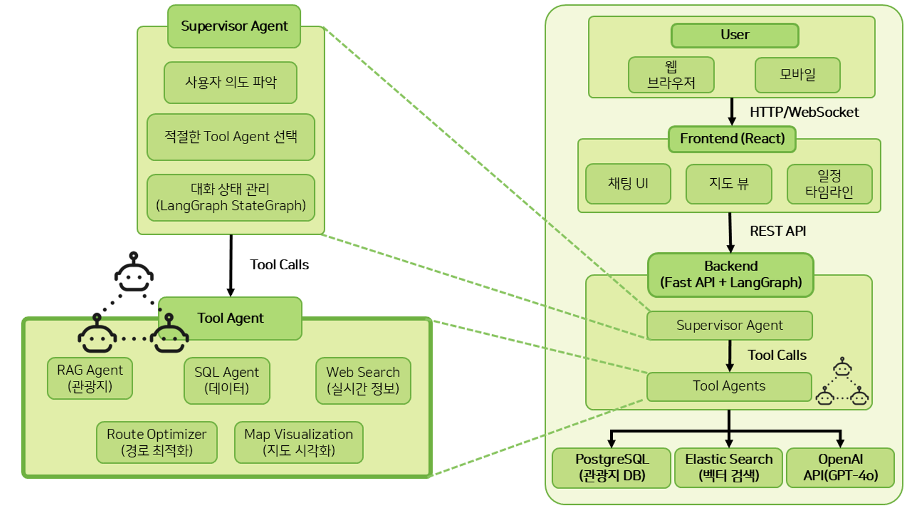
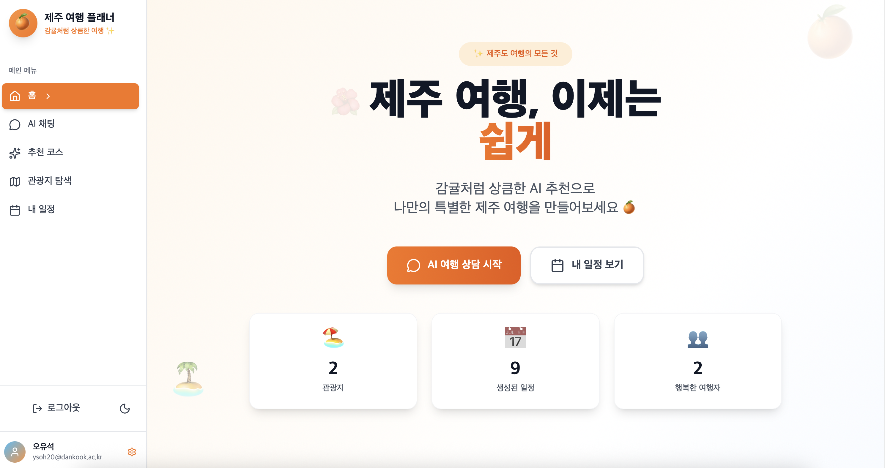
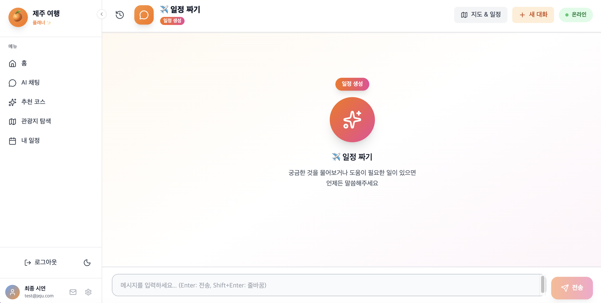
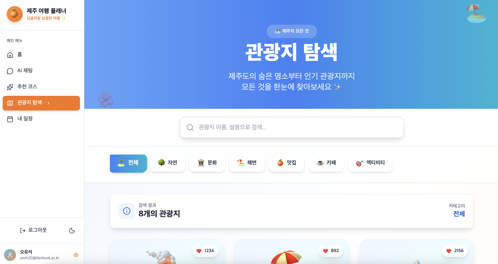
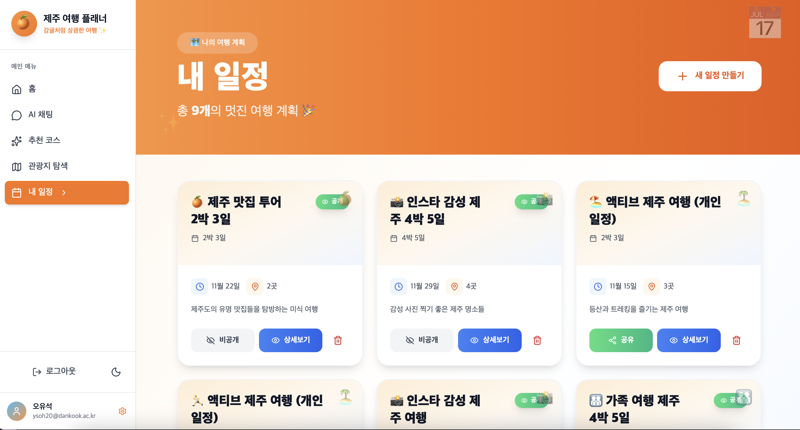
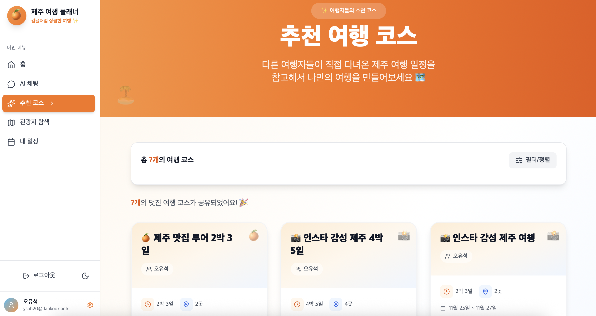
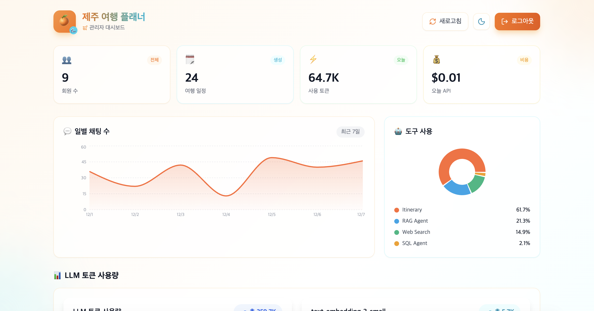

<h1>제주 AI 여행 플래너 🍊</h1>

<p align="center">
  <strong>멀티 에이전트 AI 챗봇이 붙어 있는 제주도 여행 일정 추천 서비스</strong>
</p>

<p align="center">
  
  
  
</p>

<p align="center"><strong>재주꾼 🍊🌊</strong></p>

<hr>

<p>
이 프로젝트는 LangGraph 기반 멀티 에이전트 구조를 이용해, 사용자의 대화 내용을 바탕으로 제주도 여행 일정을 자동으로 만들어 주고 이동 경로를 계산해 주는 제주 여행 웹 서비스입니다. 🏝️<br><br>
</p>

<hr>

<br>

<div id="team-members">
  <h2>팀원 소개</h2>
  <table>
    <thead>
      <tr>
        <th>이름</th>
        <th>역할</th>
        <th>주요 업무</th>
        <th>GitHub</th>
      </tr>
    </thead>
    <tbody>
      <tr>
        <td><strong>오유석</strong></td>
        <td>팀장 / AI</td>
        <td>프로젝트 방향 설정, LangGraph 기반 전체 아키텍처 설계, Supervisor Agent 및 Tool 호출 흐름 설계, 관리자 대시보드 세부 기능 설계·구현, RAG/SQL Agent 기본 구조 구현</td>
        <td><a href="https://github.com/DKUSeok2">바로가기</a></td>
      </tr>
      <tr>
        <td><strong>공서연</strong></td>
        <td>Frontend</td>
        <td>React 기반 UI/UX 구현, 지도 시각화, 일정 관리 페이지 및 관리자 대시보드 화면 구현</td>
        <td><a href="https://github.com/seoyeeon">바로가기</a></td>
      </tr>
      <tr>
        <td><strong>이호영</strong></td>
        <td>AI / Backend</td>
        <td>여행 일정 추천 프롬프트·평가 로직 구현, RAG/SQL/Route/Map 등 Tool Agent 세부 로직 및 튜닝, 백엔드 API 개발, 데이터 수집 및 전처리</td>
        <td><a href="https://github.com/">바로가기</a></td>
      </tr>
    </tbody>
  </table>
</div>

<hr>

<br>

<h2>프로젝트 배경</h2>

<h3>기존 문제점</h3>
<ul>
  <li><strong>정보 과부하</strong>: 수많은 관광지 정보 속에서 선택의 어려움</li>
  <li><strong>비효율적 경로</strong>: 지리적 특성을 고려하지 않은 일정으로 시간 낭비</li>
  <li><strong>개인화 부족</strong>: 가족 구성, 선호도, 예산을 고려한 맞춤 추천 부재</li>
  <li><strong>실시간 정보 부족</strong>: 날씨, 휴무일, 이벤트 등 변동사항 확인 어려움</li>
</ul>

<h3>사회적 필요성</h3>
<ul>
  <li>코로나 이후 국내 여행 수요 <strong>급증</strong></li>
  <li>AI 기반 개인화 서비스에 대한 기대 <strong>증가</strong></li>
  <li>효율적인 여행으로 더 많은 <strong>경험과 만족도</strong> 제공</li>
</ul>

<hr>

<br>

<h2>주요 목표</h2>

<ul>
  <li>✅ 자연어 대화 기반 여행 계획 수립</li>
  <li>✅ 멀티 에이전트 기반 지능형 추천 시스템</li>
  <li>✅ 최적 경로 자동 생성</li>
  <li>✅ 인터랙티브 시각화</li>
</ul>

<hr>

<br>

<h2>주요 기능</h2>

<h3>자연어 대화 기반 여행 계획 수립</h3>
<p>사용자와 대화를 통해 여행 정보 수집 및 맞춤 일정 생성</p>

<h3>멀티 에이전트 기반 지능형 추천 시스템</h3>
<table>
  <tr>
    <td><strong>RAG Agent</strong></td>
    <td>자연어 쿼리로 관광지 검색 (Elasticsearch)</td>
  </tr>
  <tr>
    <td><strong>SQL Agent</strong></td>
    <td>구조화 데이터 조회 - 가격, 평점 등 (PostgreSQL)</td>
  </tr>
  <tr>
    <td><strong>Web Search Agent</strong></td>
    <td>실시간 정보 수집 - 날씨, 축제 등 (Tavily)</td>
  </tr>
  <tr>
    <td><strong>Route Optimizer Agent</strong></td>
    <td>최적 경로 계산 (OR-Tools TSP)</td>
  </tr>
  <tr>
    <td><strong>Map Visualization Agent</strong></td>
    <td>지도 시각화 (Kakao Map API)</td>
  </tr>
</table>

<h3>자동 경로 최적화</h3>
<ul>
  <li>TSP(Traveling Salesman Problem) 알고리즘 적용</li>
  <li>이동 시간 최소화 및 체류 시간 고려</li>
  <li>영업시간, 교통 상황 반영</li>
</ul>

<h3>인터랙티브 시각화</h3>
<ul>
  <li>지도 기반 관광지 마커 및 경로 표시</li>
  <li>타임라인 형태의 일정표</li>
</ul>

<h3>여행 플랫폼 기능</h3>
<ul>
  <li><strong>여행지 탐색</strong>: 관광지, 맛집, 숙소 검색 및 상세 정보 확인</li>
  <li><strong>일정 관리</strong>: AI가 생성한 여행 일정 저장 및 수정</li>
  <li><strong>일정 공유</strong>: 커뮤니티를 통한 사용자 간 여행 코스 공유</li>
  <li><strong>소셜 로그인</strong>: Google OAuth 지원</li>
</ul>

<hr>

<br>

<h2>시스템 개요</h2>

<ul>
  <li>사용자는 웹 브라우저에서 React 프론트엔드와 상호작용합니다.</li>
  <li>프론트엔드는 FastAPI 백엔드로 요청을 보내고, 백엔드는 LangGraph 기반 Supervisor Agent를 통해 적절한 Tool Agent를 선택합니다.</li>
  <li>각 Tool Agent는 PostgreSQL, Elasticsearch, OpenAI, Tavily, Kakao Maps 등 외부 시스템과 통신해 필요한 정보를 가져옵니다.</li>
</ul>

<hr>

<br>

<h2>기술 스택</h2>

<table>
  <tr>
    <th style="text-align:left; width:130px;">AI</th>
    <td>
      
      
      
    </td>
  </tr>
  <tr>
    <th style="text-align:left;">Backend</th>
    <td>
      
      
    </td>
  </tr>
  <tr>
    <th style="text-align:left;">Frontend</th>
    <td>
      
      
      
    </td>
  </tr>
  <tr>
    <th style="text-align:left;">Deployment</th>
    <td>
      
      
      
      
    </td>
  </tr>
  <tr>
    <th style="text-align:left;">Data &amp; Infra</th>
    <td>
      
      
      
    </td>
  </tr>
</table>

<hr>

<br>

<h2>시스템 아키텍처</h2>

<p align="center">
  
</p>

<hr>

<br>

<h2>프로젝트 구조</h2>

```
jeju-travel-chatbot/
├── frontend/                       # 프론트엔드 (React + TypeScript)
│   ├── src/
│   │   ├── components/             # React 컴포넌트
│   │   ├── pages/                  # 페이지 컴포넌트
│   │   ├── api/                    # API 통신 모듈
│   │   └── contexts/               # React Context
│   ├── package.json
│   └── vite.config.ts
│
├── backend/                        # 백엔드 (Python + FastAPI)
│   ├── src/
│   │   ├── api/routers/            # FastAPI 라우터
│   │   ├── supervisor_agent/       # 중앙 조율 에이전트 (LangGraph)
│   │   ├── tool_agents/            # 도구 에이전트들
│   │   │   ├── rag_agent/          # RAG 검색 에이전트
│   │   │   ├── sql_agent/          # SQL 쿼리 에이전트
│   │   │   ├── web_search_agent/   # 웹 검색 에이전트
│   │   │   ├── route_optimizer_agent/  # 경로 최적화 에이전트
│   │   │   └── map_visualization_agent/ # 지도 시각화 에이전트
│   │   ├── models/                 # SQLAlchemy 모델
│   │   └── storage/                # 데이터 저장소 연동
│   ├── scripts/                    # 데이터 수집/초기화 스크립트
│   └── pyproject.toml              # Poetry 의존성
│
├── deploy/                         # 배포 관련 설정
│   └── init-db/                    # DB 초기화 스크립트
│
└── docker-compose.yml              # Docker Compose 설정
```

<hr>

<br>

<h2>스크린샷</h2>

<h3>사용자 화면</h3>

<table>
  <tr>
    <td align="center" width="33%">
      <br>
      <strong>사용자 메인 페이지</strong>
    </td>
    <td align="center" width="33%">
      <br>
      <strong>채팅페이지</strong>
    </td>
    <td align="center" width="33%">
      <br>
      <strong>여행지 탐색 페이지</strong>
    </td>
  </tr>
</table>

<table>
  <tr>
    <td align="center" width="33%">
      <br>
      <strong>AI 생성 일정 페이지</strong>
    </td>
    <td align="center" width="33%">
      <br>
      <strong>사용자 간 일정 공유 페이지</strong>
    </td>
    <td align="center" width="33%">
      <br>
      <strong>관리자 대시보드</strong>
    </td>
  </tr>
</table>

<hr>

<br>

<h2>관리자 대시보드</h2>

<p>서비스 운영 및 모니터링을 위한 관리자 전용 페이지입니다.</p>

<table>
  <tr>
    <td><strong>대시보드 통계</strong></td>
    <td>회원 수, 생성된 일정 수, 오늘 사용 토큰, API 비용 실시간 확인</td>
  </tr>
  <tr>
    <td><strong>일별 채팅 수</strong></td>
    <td>최근 7일간 채팅 추이 시각화 (Area Chart)</td>
  </tr>
  <tr>
    <td><strong>도구 사용 분포</strong></td>
    <td>SQL Agent, RAG Agent, Web Search 등 에이전트별 사용 비율 (Pie Chart)</td>
  </tr>
  <tr>
    <td><strong>LLM 토큰 사용량</strong></td>
    <td>일별/시간별/모델별 토큰 사용량 및 비용 추적</td>
  </tr>
  <tr>
    <td><strong>시스템 상태</strong></td>
    <td>PostgreSQL, Elasticsearch 연결 상태 모니터링</td>
  </tr>
  <tr>
    <td><strong>LLM 모델 설정</strong></td>
    <td>GPT-4o, GPT-4o-mini 등 AI 모델 실시간 변경</td>
  </tr>
  <tr>
    <td><strong>사용자 관리</strong></td>
    <td>사용자 목록 조회, 권한 변경, 계정 활성화/비활성화</td>
  </tr>
</table>

<hr>

<br>

<h2>프로젝트 결과</h2>

<table>
  <tr>
    <td align="center"><strong>여행 계획 시간</strong></td>
    <td><strong>80% 단축</strong> - 기존 15시간 → AI 대화 기반 자동화로 3시간 이내 완성</td>
  </tr>
  <tr>
    <td align="center"><strong>경로 효율</strong></td>
    <td><strong>30% 향상</strong> - TSP 최적화로 불필요한 이동거리 60km 절감, 평균 이동시간 2시간 단축</td>
  </tr>
  <tr>
    <td align="center"><strong>사용자 만족도</strong></td>
    <td><strong>향상</strong> - 대화형 + 시각화 UI로 계획 과정의 피로도 감소</td>
  </tr>
  <tr>
    <td align="center"><strong>기술적 기여</strong></td>
    <td>LangGraph 멀티 에이전트 시스템의 <strong>실제 적용 및 성능 검증 사례</strong> 제시</td>
  </tr>
</table>

<hr>

<br>

<h2>실행 방법</h2>

<h3>사전 요구사항</h3>
<ul>
  <li>Docker & Docker Compose</li>
  <li>Python 3.11+</li>
  <li>Node.js 18+</li>
  <li>OpenAI API Key</li>
  <li>Tavily API Key</li>
  <li>Kakao Map API Key</li>
</ul>

<h3>1. 환경 변수 설정</h3>

```bash
# backend/.env 파일 생성
cp backend/.env.example backend/.env
# .env 파일을 열어 API 키를 입력하세요
```

<h3>2. Docker로 전체 시스템 실행</h3>

```bash
docker-compose up -d
```

<h3>3. 개발 모드 실행</h3>

```bash
# 백엔드 실행
cd backend
poetry install
poetry run uvicorn src.api.app:app --reload --port 8000

# 프론트엔드 실행 (새 터미널)
cd frontend
npm install
npm run dev
```

<h3>4. 서비스 접속</h3>
<ul>
  <li>🌐 Frontend: <code>http://localhost:5173</code></li>
  <li>⚙️ Backend API: <code>http://localhost:8000</code></li>
  <li>📚 API Docs: <code>http://localhost:8000/docs</code></li>
</ul>

<hr>

<br>

<h2>관련 링크</h2>

<ul>
  <li>📹 <a href="#" target="_blank">시연 영상 바로가기</a> (추가 예정)</li>
  <li>📘 <a href="#" target="_blank">프로젝트 문서 바로가기</a> (추가 예정)</li>
</ul>

<hr>

<br>

<h2>라이센스</h2>

<p>이 프로젝트는 <strong>MIT License</strong>를 따릅니다.</p>

<hr>

<p align="center">
  <strong>단국대학교 소프트웨어학과 졸업 프로젝트</strong><br>
  <strong>재주꾼</strong><br>
  Jeju AI Travel Planner
</p>
